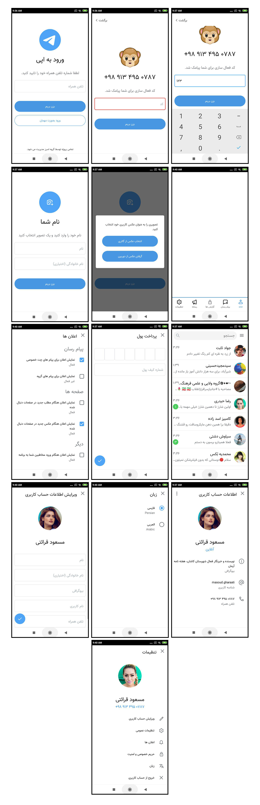

# Telegram Concept Android

A new Android application based on new telegram concepts design Using pure Android with support SDK 9 and up to more.

## Pages Layout

- Login page
- Register page
- Verify Code page
- Main page with bottom navigation
- Setting page
- Setting Notification page
- Setting Privacy page
- Profile page
- Edit Profile page
- Pay money page
- Report Page
- Submit new report page
- Setting Language page
- Chat list page

## Features

- Mini Size
- All devices support (SDK9 and up to more)
- Pure Java (Not react native and others)
- Without any extra library
- Custom font
- Own elements(checkbox, radiobutton, textbox, button, ...)

---------

# Max Base

My nickname is Max, Programming language developer, Full-stack programmer. I love computer scientists, researchers, and compilers.

## Asrez Team

A team includes some programmer, developer, designer, researcher(s) especially Max Base.

[Asrez Team](https://www.asrez.com/)
